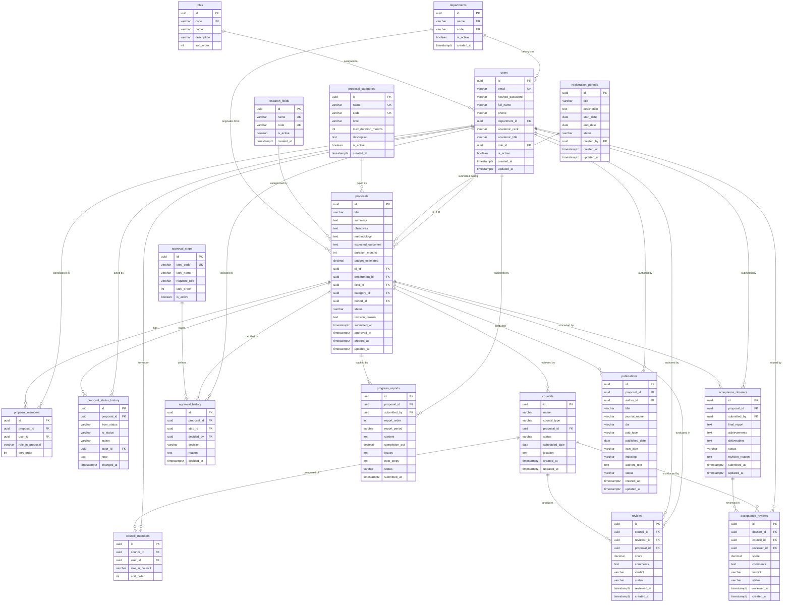

# SciRes MVP — Domain Model & Database Schema

> **Version:** 2.0  
> **Last Updated:** 2026-04-15  
> **Author:** Solution Architect  
> **Purpose:** Single source of truth for all database entities, relationships, constraints, and migration plan.

---

## 1. Entity List

| # | Entity | Table Name | Description | Module |
|---|--------|-----------|-------------|--------|
| 1 | User | `users` | System users (faculty, staff, leadership, reviewers, admins) | Auth |
| 2 | Role | `roles` | Role definitions for RBAC | Auth |
| 3 | Department | `departments` | Organizational units (faculties, schools, centers) | Catalog |
| 4 | Research Field | `research_fields` | Subject areas for classification | Catalog |
| 5 | Proposal Category | `proposal_categories` | Types of research proposals (cấp trường, cấp khoa…) | Catalog |
| 6 | Registration Period | `registration_periods` | Time windows for proposal submission | Period |
| 7 | Proposal | `proposals` | Research project proposals | Proposal |
| 8 | Proposal Member | `proposal_members` | Team members (PI, co-investigators, consultants) | Proposal |
| 9 | Proposal Status History | `proposal_status_history` | Audit log of all status transitions | Proposal |
| 10 | Council | `councils` | Review or acceptance panels | Review |
| 11 | Council Member | `council_members` | Individual panel members with roles | Review |
| 12 | Review | `reviews` | Reviewer scores and comments for proposals | Review |
| 13 | Approval Step | `approval_steps` | Configured workflow step definitions | Approval |
| 14 | Approval History | `approval_history` | Actual decisions made at each step | Approval |
| 15 | Progress Report | `progress_reports` | Periodic execution reports by PI | Progress |
| 16 | Acceptance Dossier | `acceptance_dossiers` | Final acceptance submission package | Acceptance |
| 17 | Acceptance Review | `acceptance_reviews` | Acceptance council member evaluations | Acceptance |
| 18 | Publication | `publications` | Scientific publications linked to proposals | Publication |

---

## 2. Entity Relationship Diagram



---

## 3. Table Definitions

### 3.1 `roles`

| Column | Type | Constraints | Description |
|--------|------|-------------|-------------|
| id | UUID | PK, DEFAULT uuid_generate_v4() | |
| code | VARCHAR(20) | UNIQUE, NOT NULL | `ADMIN`, `STAFF`, `LEADERSHIP`, `FACULTY`, `REVIEWER` |
| name | VARCHAR(100) | NOT NULL | Vietnamese display name |
| description | TEXT | | |
| sort_order | INTEGER | NOT NULL, DEFAULT 0 | Display ordering |

### 3.2 `users`

| Column | Type | Constraints | Description |
|--------|------|-------------|-------------|
| id | UUID | PK | |
| email | VARCHAR(255) | UNIQUE, NOT NULL | Login identifier |
| hashed_password | VARCHAR(255) | NOT NULL | bcrypt hash |
| full_name | VARCHAR(200) | NOT NULL | |
| phone | VARCHAR(20) | | |
| department_id | UUID | FK → departments.id, NULLABLE | |
| academic_rank | VARCHAR(50) | | Giáo sư, PGS, TS, ThS |
| academic_title | VARCHAR(50) | | Giảng viên, GV chính, GV cao cấp |
| role_id | UUID | FK → roles.id, NOT NULL | Single role (MVP) |
| is_active | BOOLEAN | NOT NULL, DEFAULT true | Soft delete |
| created_at | TIMESTAMPTZ | NOT NULL, DEFAULT now() | |
| updated_at | TIMESTAMPTZ | NOT NULL, DEFAULT now() | Auto-updated |

### 3.3 `departments`

| Column | Type | Constraints | Description |
|--------|------|-------------|-------------|
| id | UUID | PK | |
| name | VARCHAR(200) | UNIQUE, NOT NULL | Full name |
| code | VARCHAR(20) | UNIQUE, NOT NULL | Short code (e.g., CNTT) |
| is_active | BOOLEAN | NOT NULL, DEFAULT true | |
| created_at | TIMESTAMPTZ | NOT NULL, DEFAULT now() | |

### 3.4 `research_fields`

| Column | Type | Constraints | Description |
|--------|------|-------------|-------------|
| id | UUID | PK | |
| name | VARCHAR(200) | UNIQUE, NOT NULL | |
| code | VARCHAR(20) | UNIQUE, NOT NULL | |
| is_active | BOOLEAN | NOT NULL, DEFAULT true | |
| created_at | TIMESTAMPTZ | NOT NULL, DEFAULT now() | |

### 3.5 `proposal_categories`

| Column | Type | Constraints | Description |
|--------|------|-------------|-------------|
| id | UUID | PK | |
| name | VARCHAR(200) | UNIQUE, NOT NULL | e.g., "Đề tài cấp trường" |
| code | VARCHAR(20) | UNIQUE, NOT NULL | e.g., "CAP_TRUONG" |
| level | VARCHAR(50) | NOT NULL | UNIVERSITY, FACULTY, MINISTERIAL |
| max_duration_months | INTEGER | | Default max duration |
| description | TEXT | | |
| is_active | BOOLEAN | NOT NULL, DEFAULT true | |
| created_at | TIMESTAMPTZ | NOT NULL, DEFAULT now() | |

### 3.6 `registration_periods`

| Column | Type | Constraints | Description |
|--------|------|-------------|-------------|
| id | UUID | PK | |
| title | VARCHAR(300) | NOT NULL | |
| description | TEXT | | |
| start_date | DATE | NOT NULL | |
| end_date | DATE | NOT NULL | |
| status | VARCHAR(20) | NOT NULL, DEFAULT 'DRAFT' | DRAFT, OPEN, CLOSED |
| created_by | UUID | FK → users.id | Staff who created |
| created_at | TIMESTAMPTZ | NOT NULL, DEFAULT now() | |
| updated_at | TIMESTAMPTZ | NOT NULL, DEFAULT now() | |

**CHECK:** `end_date > start_date`

### 3.7 `proposals`

| Column | Type | Constraints | Description |
|--------|------|-------------|-------------|
| id | UUID | PK | |
| title | VARCHAR(500) | NOT NULL | |
| summary | TEXT | | |
| objectives | TEXT | | |
| methodology | TEXT | | |
| expected_outcomes | TEXT | | |
| duration_months | INTEGER | CHECK (1-36) | |
| budget_estimated | DECIMAL(15,2) | | VND, for future financial module |
| pi_id | UUID | FK → users.id, NOT NULL | Principal investigator |
| department_id | UUID | FK → departments.id | PI's department at submission time |
| field_id | UUID | FK → research_fields.id | |
| category_id | UUID | FK → proposal_categories.id | |
| period_id | UUID | FK → registration_periods.id | |
| status | VARCHAR(40) | NOT NULL, DEFAULT 'DRAFT' | See §6 |
| revision_reason | TEXT | | Filled when returned |
| submitted_at | TIMESTAMPTZ | | |
| approved_at | TIMESTAMPTZ | | |
| created_at | TIMESTAMPTZ | NOT NULL, DEFAULT now() | |
| updated_at | TIMESTAMPTZ | NOT NULL, DEFAULT now() | |

**UNIQUE:** `(title, period_id)` — no duplicate titles within same period

### 3.8 `proposal_members`

| Column | Type | Constraints | Description |
|--------|------|-------------|-------------|
| id | UUID | PK | |
| proposal_id | UUID | FK → proposals.id ON DELETE CASCADE, NOT NULL | |
| user_id | UUID | FK → users.id, NOT NULL | |
| role_in_proposal | VARCHAR(30) | NOT NULL, DEFAULT 'CO_INVESTIGATOR' | PI, CO_INVESTIGATOR, CONSULTANT |
| sort_order | INTEGER | NOT NULL, DEFAULT 0 | |

**UNIQUE:** `(proposal_id, user_id)` — no duplicate membership

### 3.9 `proposal_status_history`

| Column | Type | Constraints | Description |
|--------|------|-------------|-------------|
| id | UUID | PK | |
| proposal_id | UUID | FK → proposals.id ON DELETE CASCADE, NOT NULL | |
| from_status | VARCHAR(40) | | NULL for initial creation |
| to_status | VARCHAR(40) | NOT NULL | |
| action | VARCHAR(50) | NOT NULL | create, submit, validate, etc. |
| actor_id | UUID | FK → users.id | NULL for SYSTEM actions |
| note | TEXT | | |
| changed_at | TIMESTAMPTZ | NOT NULL, DEFAULT now() | |

### 3.10 `councils`

| Column | Type | Constraints | Description |
|--------|------|-------------|-------------|
| id | UUID | PK | |
| name | VARCHAR(300) | NOT NULL | |
| council_type | VARCHAR(30) | NOT NULL | PROPOSAL_REVIEW, ACCEPTANCE |
| proposal_id | UUID | FK → proposals.id, NOT NULL | |
| status | VARCHAR(20) | NOT NULL, DEFAULT 'FORMING' | FORMING, ACTIVE, COMPLETED |
| scheduled_date | DATE | | Council meeting date |
| location | TEXT | | Meeting location |
| created_at | TIMESTAMPTZ | NOT NULL, DEFAULT now() | |
| updated_at | TIMESTAMPTZ | NOT NULL, DEFAULT now() | |

### 3.11 `council_members`

| Column | Type | Constraints | Description |
|--------|------|-------------|-------------|
| id | UUID | PK | |
| council_id | UUID | FK → councils.id ON DELETE CASCADE, NOT NULL | |
| user_id | UUID | FK → users.id, NOT NULL | |
| role_in_council | VARCHAR(30) | NOT NULL, DEFAULT 'REVIEWER' | CHAIR, SECRETARY, REVIEWER |
| sort_order | INTEGER | NOT NULL, DEFAULT 0 | |

**UNIQUE:** `(council_id, user_id)` — no duplicate membership

### 3.12 `reviews`

| Column | Type | Constraints | Description |
|--------|------|-------------|-------------|
| id | UUID | PK | |
| council_id | UUID | FK → councils.id, NOT NULL | |
| reviewer_id | UUID | FK → users.id, NOT NULL | |
| proposal_id | UUID | FK → proposals.id, NOT NULL | |
| score | DECIMAL(5,2) | CHECK (0-100) | |
| comments | TEXT | | |
| verdict | VARCHAR(20) | | PASS, FAIL, NEEDS_REVISION |
| status | VARCHAR(20) | NOT NULL, DEFAULT 'PENDING' | PENDING, SUBMITTED |
| reviewed_at | TIMESTAMPTZ | | |
| created_at | TIMESTAMPTZ | NOT NULL, DEFAULT now() | |

**UNIQUE:** `(council_id, reviewer_id)` — one review per reviewer per council

### 3.13 `approval_steps`

| Column | Type | Constraints | Description |
|--------|------|-------------|-------------|
| id | UUID | PK | |
| step_code | VARCHAR(30) | UNIQUE, NOT NULL | STAFF_VALIDATE, COUNCIL_REVIEW, LEADERSHIP_APPROVE |
| step_name | VARCHAR(100) | NOT NULL | Vietnamese display name |
| required_role | VARCHAR(20) | NOT NULL | Role code needed to act |
| step_order | INTEGER | NOT NULL | Execution order (1, 2, 3…) |
| is_active | BOOLEAN | NOT NULL, DEFAULT true | |

### 3.14 `approval_history`

| Column | Type | Constraints | Description |
|--------|------|-------------|-------------|
| id | UUID | PK | |
| proposal_id | UUID | FK → proposals.id, NOT NULL | |
| step_id | UUID | FK → approval_steps.id, NOT NULL | |
| decided_by | UUID | FK → users.id, NOT NULL | |
| decision | VARCHAR(20) | NOT NULL | APPROVED, REJECTED, RETURNED |
| reason | TEXT | | Required for REJECTED/RETURNED |
| decided_at | TIMESTAMPTZ | NOT NULL, DEFAULT now() | |

### 3.15 `progress_reports`

| Column | Type | Constraints | Description |
|--------|------|-------------|-------------|
| id | UUID | PK | |
| proposal_id | UUID | FK → proposals.id, NOT NULL | |
| submitted_by | UUID | FK → users.id, NOT NULL | |
| report_order | INTEGER | NOT NULL | Auto-incremented per proposal |
| report_period | VARCHAR(50) | | e.g., "Tháng 3-4/2026" |
| content | TEXT | NOT NULL | |
| completion_pct | DECIMAL(5,2) | NOT NULL, CHECK (0-100) | |
| issues | TEXT | | |
| next_steps | TEXT | NOT NULL | |
| status | VARCHAR(20) | NOT NULL, DEFAULT 'SUBMITTED' | SUBMITTED (MVP) |
| submitted_at | TIMESTAMPTZ | NOT NULL, DEFAULT now() | |

**UNIQUE:** `(proposal_id, report_order)` — no duplicate report numbers

### 3.16 `acceptance_dossiers`

| Column | Type | Constraints | Description |
|--------|------|-------------|-------------|
| id | UUID | PK | |
| proposal_id | UUID | FK → proposals.id, NOT NULL | |
| submitted_by | UUID | FK → users.id, NOT NULL | |
| final_report | TEXT | NOT NULL | |
| achievements | TEXT | NOT NULL | |
| deliverables | TEXT | | Products, software, prototypes |
| status | VARCHAR(30) | NOT NULL, DEFAULT 'SUBMITTED' | See §6 |
| revision_reason | TEXT | | |
| submitted_at | TIMESTAMPTZ | NOT NULL, DEFAULT now() | |
| updated_at | TIMESTAMPTZ | NOT NULL, DEFAULT now() | |

**UNIQUE:** `(proposal_id)` — one dossier per proposal (MVP)

### 3.17 `acceptance_reviews`

| Column | Type | Constraints | Description |
|--------|------|-------------|-------------|
| id | UUID | PK | |
| dossier_id | UUID | FK → acceptance_dossiers.id, NOT NULL | |
| council_id | UUID | FK → councils.id, NOT NULL | |
| reviewer_id | UUID | FK → users.id, NOT NULL | |
| score | DECIMAL(5,2) | CHECK (0-100) | |
| comments | TEXT | | |
| verdict | VARCHAR(20) | | PASS, FAIL |
| status | VARCHAR(20) | NOT NULL, DEFAULT 'PENDING' | PENDING, SUBMITTED |
| reviewed_at | TIMESTAMPTZ | | |
| created_at | TIMESTAMPTZ | NOT NULL, DEFAULT now() | |

**UNIQUE:** `(dossier_id, reviewer_id)` — one review per reviewer per dossier

### 3.18 `publications`

| Column | Type | Constraints | Description |
|--------|------|-------------|-------------|
| id | UUID | PK | |
| proposal_id | UUID | FK → proposals.id | Nullable (standalone publications) |
| author_id | UUID | FK → users.id, NOT NULL | Primary/submitting author |
| title | VARCHAR(500) | NOT NULL | |
| journal_name | VARCHAR(300) | | Journal or conference name |
| doi | VARCHAR(100) | UNIQUE | |
| pub_type | VARCHAR(30) | NOT NULL | JOURNAL, CONFERENCE, BOOK_CHAPTER, PATENT |
| published_date | DATE | | |
| issn_isbn | VARCHAR(30) | | |
| indexing | VARCHAR(50) | | SCOPUS, WOS, OTHER, DOMESTIC |
| authors_text | TEXT | | Full author list as text |
| status | VARCHAR(20) | NOT NULL, DEFAULT 'DRAFT' | DRAFT, PUBLISHED, VERIFIED |
| created_at | TIMESTAMPTZ | NOT NULL, DEFAULT now() | |
| updated_at | TIMESTAMPTZ | NOT NULL, DEFAULT now() | |

---

## 4. Constraints Summary

### Foreign Key Constraints

| Table | Column | References | On Delete |
|-------|--------|-----------|-----------|
| users | department_id | departments.id | SET NULL |
| users | role_id | roles.id | RESTRICT |
| registration_periods | created_by | users.id | SET NULL |
| proposals | pi_id | users.id | RESTRICT |
| proposals | department_id | departments.id | SET NULL |
| proposals | field_id | research_fields.id | SET NULL |
| proposals | category_id | proposal_categories.id | SET NULL |
| proposals | period_id | registration_periods.id | SET NULL |
| proposal_members | proposal_id | proposals.id | CASCADE |
| proposal_members | user_id | users.id | CASCADE |
| proposal_status_history | proposal_id | proposals.id | CASCADE |
| proposal_status_history | actor_id | users.id | SET NULL |
| councils | proposal_id | proposals.id | RESTRICT |
| council_members | council_id | councils.id | CASCADE |
| council_members | user_id | users.id | CASCADE |
| reviews | council_id | councils.id | CASCADE |
| reviews | reviewer_id | users.id | RESTRICT |
| reviews | proposal_id | proposals.id | RESTRICT |
| approval_history | proposal_id | proposals.id | CASCADE |
| approval_history | step_id | approval_steps.id | RESTRICT |
| approval_history | decided_by | users.id | RESTRICT |
| progress_reports | proposal_id | proposals.id | CASCADE |
| progress_reports | submitted_by | users.id | RESTRICT |
| acceptance_dossiers | proposal_id | proposals.id | RESTRICT |
| acceptance_dossiers | submitted_by | users.id | RESTRICT |
| acceptance_reviews | dossier_id | acceptance_dossiers.id | CASCADE |
| acceptance_reviews | council_id | councils.id | RESTRICT |
| acceptance_reviews | reviewer_id | users.id | RESTRICT |
| publications | proposal_id | proposals.id | SET NULL |
| publications | author_id | users.id | RESTRICT |

### Check Constraints

| Table | Constraint | Expression |
|-------|-----------|------------|
| registration_periods | ck_period_dates | `end_date > start_date` |
| proposals | ck_duration | `duration_months BETWEEN 1 AND 36` |
| reviews | ck_review_score | `score BETWEEN 0 AND 100` |
| progress_reports | ck_completion | `completion_pct BETWEEN 0 AND 100` |
| acceptance_reviews | ck_acc_score | `score BETWEEN 0 AND 100` |

### Unique Constraints

| Table | Columns | Name |
|-------|---------|------|
| proposals | (title, period_id) | uq_proposal_title_period |
| proposal_members | (proposal_id, user_id) | uq_proposal_member |
| council_members | (council_id, user_id) | uq_council_member |
| reviews | (council_id, reviewer_id) | uq_review_per_council |
| progress_reports | (proposal_id, report_order) | uq_progress_order |
| acceptance_dossiers | (proposal_id) | uq_acceptance_per_proposal |
| acceptance_reviews | (dossier_id, reviewer_id) | uq_acceptance_review |

---

## 5. Indexes

| Table | Index Name | Columns | Purpose |
|-------|-----------|---------|---------|
| users | ix_users_email | email | Login lookup |
| users | ix_users_role_id | role_id | Filter by role |
| users | ix_users_department_id | department_id | Filter by department |
| proposals | ix_proposals_pi_id | pi_id | Faculty's proposals |
| proposals | ix_proposals_status | status | Filter by status |
| proposals | ix_proposals_period_id | period_id | Proposals per period |
| proposals | ix_proposals_category_id | category_id | Filter by category |
| reviews | ix_reviews_reviewer_id | reviewer_id | Reviewer's assignments |
| reviews | ix_reviews_status | status | Pending reviews |
| progress_reports | ix_progress_proposal_id | proposal_id | Reports per proposal |
| approval_history | ix_approval_proposal_id | proposal_id | Decisions per proposal |
| publications | ix_publications_proposal_id | proposal_id | Publications per proposal |
| publications | ix_publications_author_id | author_id | Author's publications |
| proposal_status_history | ix_status_history_proposal | proposal_id | History per proposal |
| councils | ix_councils_proposal_id | proposal_id | Councils per proposal |

---

## 6. Enums / Status Definitions

### Proposal Status

| Code | Label (VI) | Terminal? |
|------|-----------|----------|
| DRAFT | Bản nháp | No |
| SUBMITTED | Đã nộp | No |
| REVISION_REQUESTED | Yêu cầu chỉnh sửa | No |
| VALIDATED | Đã kiểm tra | No |
| UNDER_REVIEW | Đang phản biện | No |
| REVIEWED | Đã phản biện | No |
| APPROVED | Đã phê duyệt | No |
| REJECTED | Từ chối | **Yes** |
| IN_PROGRESS | Đang thực hiện | No |
| ACCEPTANCE_SUBMITTED | Đã nộp nghiệm thu | No |
| UNDER_ACCEPTANCE_REVIEW | Đang nghiệm thu | No |
| ACCEPTANCE_REVISION_REQUESTED | Yêu cầu bổ sung | No |
| ACCEPTED | Nghiệm thu thành công | **Yes** |
| ACCEPTANCE_FAILED | Nghiệm thu không đạt | **Yes** |

### Period Status
`DRAFT` → `OPEN` → `CLOSED`

### Council Status
`FORMING` → `ACTIVE` → `COMPLETED`

### Review / Acceptance Review Status
`PENDING` → `SUBMITTED`

### Review Verdict
`PASS` | `FAIL` | `NEEDS_REVISION`

### Acceptance Verdict
`PASS` | `FAIL`

### Approval Decision
`APPROVED` | `REJECTED` | `RETURNED`

### Dossier Status
`SUBMITTED` → `REVISION_REQUESTED` → `SUBMITTED` (loop)  
`SUBMITTED` → `UNDER_REVIEW` → `PASSED` | `FAILED`

### Member Role In Proposal
`PI` | `CO_INVESTIGATOR` | `CONSULTANT`

### Role In Council
`CHAIR` | `SECRETARY` | `REVIEWER`

### Publication Type
`JOURNAL` | `CONFERENCE` | `BOOK_CHAPTER` | `PATENT`

### Publication Indexing
`SCOPUS` | `WOS` | `OTHER` | `DOMESTIC`

### Publication Status
`DRAFT` | `PUBLISHED` | `VERIFIED`

### Proposal Category Level
`UNIVERSITY` | `FACULTY` | `MINISTERIAL`

---

## 7. Migration Plan

### Phase 1: Base Tables (This migration)

All 18 tables created in dependency order:

```
1. roles                    (no FK)
2. departments              (no FK)  
3. research_fields           (no FK)
4. proposal_categories       (no FK)
5. approval_steps            (no FK)
6. users                    (FK → roles, departments)
7. registration_periods      (FK → users)
8. proposals                (FK → users, departments, fields, categories, periods)
9. proposal_members          (FK → proposals, users)
10. proposal_status_history  (FK → proposals, users)
11. councils                (FK → proposals)
12. council_members          (FK → councils, users)
13. reviews                 (FK → councils, users, proposals)
14. approval_history         (FK → proposals, approval_steps, users)
15. progress_reports         (FK → proposals, users)
16. acceptance_dossiers      (FK → proposals, users)
17. acceptance_reviews       (FK → acceptance_dossiers, councils, users)
18. publications            (FK → proposals, users)
```

### Phase 2: Seed Data

1. Roles (5 roles)
2. Departments (8 departments)
3. Research fields (10 fields)
4. Proposal categories (3 categories)
5. Approval steps (3 steps)
6. Users (8 demo users)
7. Registration periods (2 periods)

### Future Migrations (Post-MVP)

| Migration | Tables | Purpose |
|-----------|--------|---------|
| 002 | `budgets`, `expenditures` | Financial tracking |
| 003 | `notifications` | In-app notifications |
| 004 | `file_attachments` | File upload support |
| 005 | `audit_log` | Generic audit trail |
| 006 | `user_roles` (junction) | Multiple roles per user |
